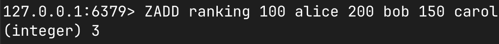
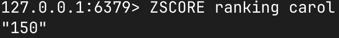
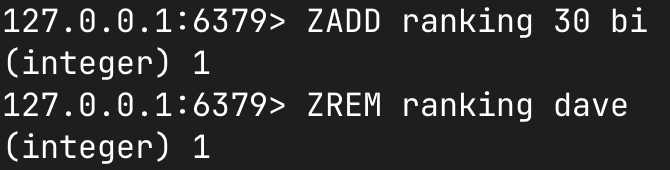
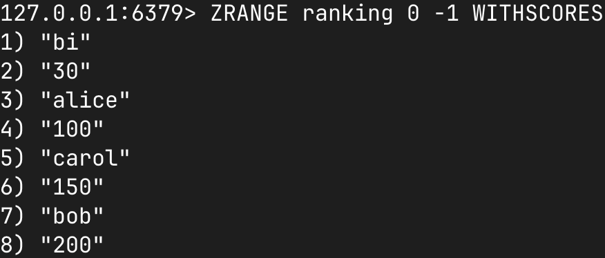
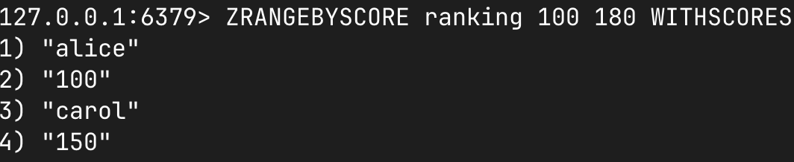
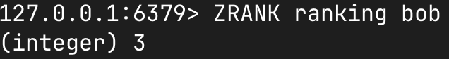

## `Set`이란?

> 중복을 허용하지 않는 자료구조. `HashSet` 기준 탐색에 평균 O(1)의 시간복잡도를 가진다.
> 구현체에 따라 순서를 보장할 수 있다.

자료구조를 Java에서 배우게 되면 자연스럽게 `Set`과 Map을 함께 배우게 되는데요. key:value 형태인 Map과 다르게 `Set`은 보통 중복처리와 집합연산에서 사용하곤 합니다.

이 글에서는 `Redis ZSET`(Sorted Set)을 이해하기 위해 Java의 `Set` 구현체를 살펴보고, `Redis ZSET`이 어떻게 효율적으로 순서를 보장하는지 알아보겠습니다.

## Java Set 구현체

Java에서 대표적인 `Set` 구현체는 3가지가 있습니다.

- `HashSet`
- `TreeSet`
- `LinkedHashSet`

### `HashSet`

`HashSet`은 내부적으로 HashMap을 사용하고 있습니다.

```java
public class HashSet<E> extends AbstractSet<E> implements Set<E>, Cloneable, java.io.Serializable {
    private transient HashMap<E,Object> map;
    private static final Object PRESENT = new Object();

    public HashSet() {
        map = new HashMap<>();
    }
}
```

`HashSet`은 HashMap을 사용하고 있습니다. HashMap은 내부적으로 배열을 사용하고 있는데요.

```java
public class HashMap<K,V> extends AbstractMap<K,V> implements Map<K,V>, Cloneable, Serializable {
```

내부적으로 결국 Map 구조에 key에 값을 넣고 value에는 항상 PRESENT 객체를 넣어줍니다.

```java
public boolean add(E e) {
    return map.put(e, PRESENT)==null;
}
```

HashMap은 hash 함수를 사용해 해시값을 버킷 배열에 분산하고, 해시 충돌을 처리하기 위해 버킷 배열을 사용합니다. 버킷 배열은 노드 형태로 이루어져 있습니다.

```
element.hashCode()
    ↓
hash 보정
    ↓
버킷 인덱스 계산
    ↓
table[index]
```

해싱을 통해 key값의 해시값을 계산하고, 해시값을 버킷 배열의 인덱스로 변환합니다. 그럼에도 같은 버킷 인덱스에 배치되는 경우 충돌이 발생하는데, 이를 해결하기 위해 체이닝 기법을 사용합니다. 체이닝 기법은 같은 버킷 인덱스에 배치된 노드를 연결리스트로 연결해줍니다. Java 8부터는 충돌이 많아지면 연결리스트를 트리 구조로 바꿔 성능 저하를 줄입니다.

```
버킷 배열
table
  ↓
[0] null
[1] Node → Node
[2] null
[3] Node
[4] TreeNode
```

이런식으로 버킷 배열과 인덱스를 사용해서 중복을 방지합니다. 조금 더 자세하게 중복 판단을 들여다보면
hashCode()와 equals() 메서드를 사용해서 중복을 판단합니다.

```java
public class User {
    private final long id;

    @Override
    public boolean equals(Object obj) {
        if (this == obj) return true;
        if (!(obj instanceof User other)) return false;

        return id == other.id;
    }

    @Override
    public int hashCode() {
        return Long.hashCode(id);
    }
}
```

시간복잡도는 add, contains, remove 모두 평균 O(1)입니다.

### `LinkedHashSet`

`LinkedHashSet`은 해시 기반 검색에 삽입 순서를 기억하는 연결 리스트 구현체 입니다. 말 그대로 LinkedHashMap에 저장하고, 들어온 순서를 DoublyLinked List 구조로 저장해서 순서를 보장합니다. 따라서, 값 기준 정렬이 아닌, 들어온 순서를 보존해주는 구조입니다.

```java
// LinkedHashMap.java (OpenJDK)
public class LinkedHashMap<K,V> extends HashMap<K,V> {
    static class Entry<K,V> extends HashMap.Node<K,V> {
        Entry<K,V> before, after;  // ← 순서 보장용
    }
    transient LinkedHashMap.Entry<K,V> head;  // 리스트의 첫 노드
    transient LinkedHashMap.Entry<K,V> tail;  // 리스트의 마지막 노드
}
```

실제 구현체는 HashMap을 상속받아 내부적으로 head와 tail을 사용해 이중 연결 리스트 구조를 순서 보장으로 사용합니다.

```java
// HashMap.Node — HashSet이 사용
static class Node<K,V> implements Map.Entry<K,V> {
    final int hash;
    final K key;
    V value;
    Node<K,V> next;  // 같은 버킷 내 충돌 체이닝용
}
// LinkedHashMap.Entry — LinkedHashSet이 사용
static class Entry<K,V> extends Node<K,V> {
    Entry<K,V> before, after;  // 전체 삽입 순서용 (추가됨)
}
```

기존에 우리가 배운 HashMap의 Node 구조는 유지하되, Entry 마다 연결 구조를 사용해서 순서를 보장하는 것이죠.

시간복잡도는 add, remove, contains 모두 평균 O(1)이지만, 반복문을 사용해 순회하는 경우 O(n)입니다.

### `TreeSet`

`TreeSet`은 균형 이진 탐색 트리인 Red-Black Tree 구조를 사용해서 **정렬된 순서**를 보장합니다. Red-Black Tree는 왼쪽 자식 노드의 값은 부모 노드의 값보다 작고, 오른쪽 자식 노드의 값은 부모 노드의 값보다 큰 이진 탐색 트리에 색상 규칙을 더해 균형을 유지하는 트리 구조입니다.

`TreeSet`에서 사용되는 TreeMap도 Map에 key를 저장하고 PRESENT를 값으로 사용하게 되는데요, TreeMap은 내부적으로 정렬된 트리를 사용하므로 정렬된 순서를 보장합니다.

```java
// TreeSet.java (OpenJDK)
public class TreeSet<E> extends AbstractSet<E> {
    private transient NavigableMap<E,Object> m;  // 실제로는 TreeMap
    public TreeSet() {
        this(new TreeMap<>());
    }
}
```

TreeMap은 Red-Black Tree 구조를 사용해서 정렬된 순서를 보장합니다.

```java
// TreeMap.java (OpenJDK) — Entry 구조 (개념)
static final class Entry<K,V> implements Map.Entry<K,V> {
    K key;
    V value;
    Entry<K,V> left;    // 왼쪽 자식
    Entry<K,V> right;   // 오른쪽 자식
    Entry<K,V> parent;
    boolean color;      // RED or BLACK
}
```

`TreeSet`은 균형 트리로 인해 정렬된 key를 보장합니다. 대신 삽입 순서를 보장하지 않습니다. 이때 중복 판단은 equals()가 아닌 compareTo() 또는 Comparator의 비교 결과를 기준으로 합니다.

3가지를 정리해보면 다음과 같습니다.

| 구현체          | 순서 보장       | 시간복잡도 |
| --------------- | --------------- | ---------- |
| `HashSet`       | 아니요          | 평균 O(1)  |
| `LinkedHashSet` | 예(삽입된 순서) | 평균 O(1)  |
| `TreeSet`       | 예(정렬된 순서) | O(log n)   |

문제에 따라 선택해서 사용하는 것이 더 효율적일 수 있습니다.

## `Redis ZSET`

그렇다면, 저희가 초반에 얘기했던 `Redis ZSET`(Sorted Set)은 어떤 구조일까요?

> **Set** : member는 중복되지 않는다.</br> **Sorted** : 각 member에 score를 붙이고 score 기준으로 정렬한다. score가 같으면 member를 사전순으로 정렬한다.

`ZSET` 이름에서 보이듯이 `TreeSet`과 가장 비슷하다고 생각하게 되는데요, 더 효율적인 최적화를 위해 score를 기준으로 정렬합니다. `TreeSet`은 member를 기준으로 정렬하는 반면, score로 정렬한 유일 member 집합입니다.

Red-Black Tree로 정렬했던 `TreeSet`과 다르게 `Redis ZSET`은 크기에 따라 두가지 인코딩을 사용합니다.

1. 작을 때 - listpack(구 ziplist)
   기준(**zset-max-listpack-entries**, **zset-max-listpack-value**)이하면 압축한 listpack 하나에 [member, score, member, score, ...] 형태로 저장해 메모리를 절약합니다.

```
listpack (구 ziplist)
┌─────────┬───────┬─────────┬───────┬─────────┬───────┐
│ member  │ score │ member  │ score │ member  │ score │
├─────────┼───────┼─────────┼───────┼─────────┼───────┤
│ "alice" │  100  │ "carol" │  150  │ "bob"   │  200  │
└─────────┴───────┴─────────┴───────┴─────────┴───────┘
```

2. 클 때 - dict + zskiplist

HashTable 구조인 dict에 member를 빠르게 찾기 위한 인덱스가 저장되고, skip list를 통해 순서를 보장하며 빠르게 찾는 구조입니다.

```c
typedef struct zset {
    dict *dict;       // member → score  (O(1) 조회)
    zskiplist *zsl;   // score 순 정렬   (O(log N) 범위/순위)
} zset;
```

```
        ZADD "alice" 100
             │
   ┌─────────┴─────────┐
   ▼                   ▼
dict (해시)        skiplist (스킵 리스트)
"alice" → 100      score 순 연결:
"bob"   → 200      100:alice → 200:bob → ...
```

Hash Table 구조로 인해 member 기준으로 값을 빠르게 찾고,

```
score:    100      200      300      400
          │        │        │        │
Level 1:  HEAD ──────────────▶ [300:bob] ──────▶ NULL
          │        │           │
Level 0:  HEAD ▶ [100:alice] ▶ [200:carol] ▶ [300:bob] ▶ [400:dave] ▶ NULL
               ◀──────── backward ────────▶
```

Level 단위 계층을 두어 높은 Level부터 찾는 값을 찾아 다음 Level로 넘어갑니다. 조금 다른 것 같으면서도 이분탐색의 구조와 비슷한 탐색 방식입니다. 따라서, skip list에서의 평균적인 탐색·삽입·삭제가 O(log N)에 가깝습니다.

### Level은 어떻게 정해지는가

삽입을 확률적으로 결정합니다(`Redis`: p ≈ 0.25).

```
새 노드 삽입 시
  Level 0: 항상 생성 (100%)
  Level 1: 25% 확률
  Level 2: 6.25% 확률
  ...
  최대 32레벨
```

```
평균적으로
Level 2:  ■ ■                    (적음 — 고속도로)
Level 1:  ■ ■ ■ ■ ■ ■           (중간)
Level 0:  ■ ■ ■ ■ ■ ■ ■ ■ ■ ■ ■ ■  (전부 — 일반 도로)

```

Red-Black Tree처럼 rebalance와 같은 작업이 필요 없이 랜덤한 확률로 레벨을 결정하여 탐색 속도를 빠르게 만들었습니다. 실제 정렬된 자료구조 중에서도 시간 단축을 위해 확률적으로 레벨과 포인터를 다루는 구조가 존재하죠.

### `Redis ZSET` 연산작업

이를 이해하면 이제 `Redis ZSET`의 해당 작업들을 이해해볼 수 있습니다. 아래 복잡도는 skiplist 인코딩 기준이며, ZADD와 ZREM은 member 하나를 처리할 때 기준입니다.

|          연산          | 주로 쓰는 구조  |           기능           |    복잡도    |
| :--------------------: | :-------------: | :----------------------: | :----------: |
|     ZSCORE member      |      dict       | 해당 member의 score 조회 |     O(1)     |
|      ZADD / ZREM       | dict + skiplist |      값 저장, 삭제       |   O(log N)   |
| ZRANGE / ZRANGEBYSCORE |    skiplist     |     순위 범위로 조회     | O(log N + M) |
|         ZRANK          |    skiplist     | 특정 member의 순위 조회  |   O(log N)   |

### `Redis ZSET` 연산 예시

먼저 아래와 같이 member와 score를 저장해보겠습니다.



<br/>

#### ZSCORE

특정 member의 score를 조회합니다.



<br/>

#### ZADD / ZREM

새 member를 추가하거나, 기존 member의 score를 변경할 수 있습니다. ZREM을 사용하면 member를 삭제합니다.



<br/>

#### ZRANGE / ZRANGEBYSCORE

ZRANGE는 순위 범위를, ZRANGEBYSCORE는 score 범위를 기준으로 조회합니다.




</br>

#### ZRANK

특정 member의 순위를 조회합니다. 순위는 0부터 시작합니다.



<br/>

### 참고 자료

- [redis sorted set](https://redis.io/docs/latest/develop/data-types/sorted-sets/)
